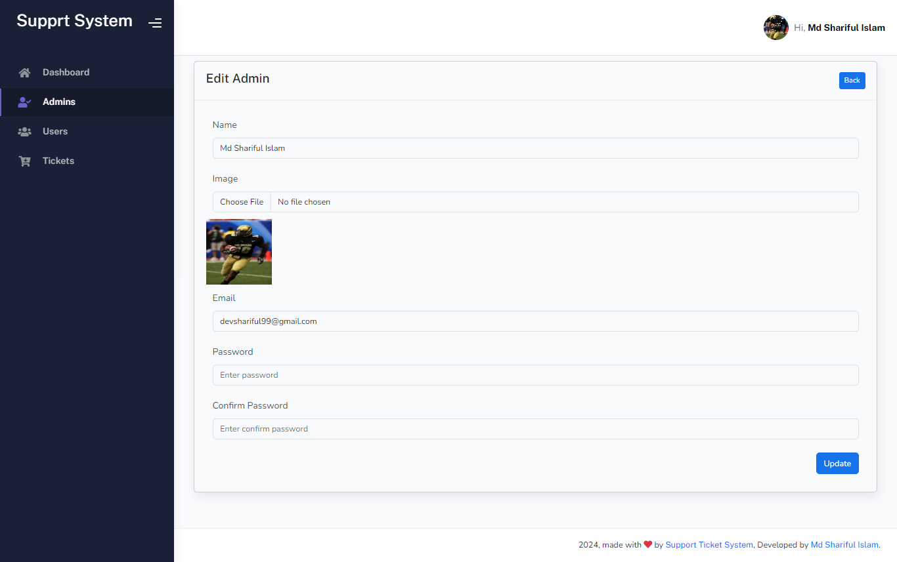

# Default Login Credential (Seeder)

## Admin Login
<b>Email :</b> admin@dev.com 
<b>Password :</b> admin@dev.com

## User Login
<b>Email :</b> user@dev.com 
<b>Password :</b> user@dev.com

# Admin Panel

Admin Login

Admin Dashboard

### Admin Management

Admin List

Admin Create

Admin Edit

Admin Details

### User Management

User List

User Create

User Edit

User Details

### Ticket Management

Ticket List

Ticket Details

# User Panel

User Login

User Registration

User Dashboard

### Ticket Management

Ticket List

Ticket Details

